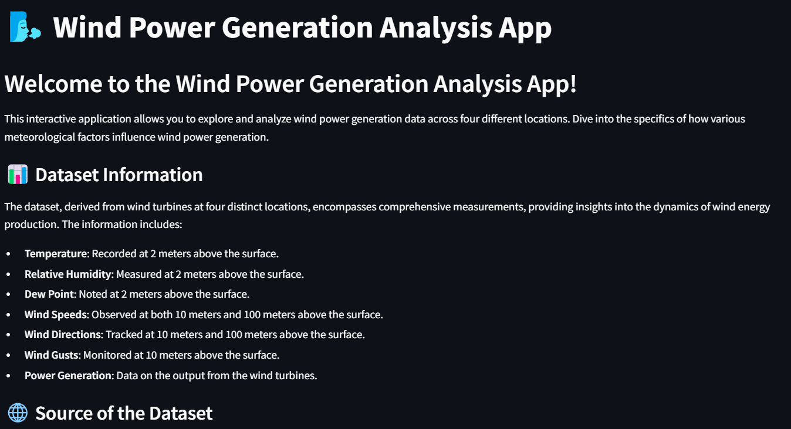
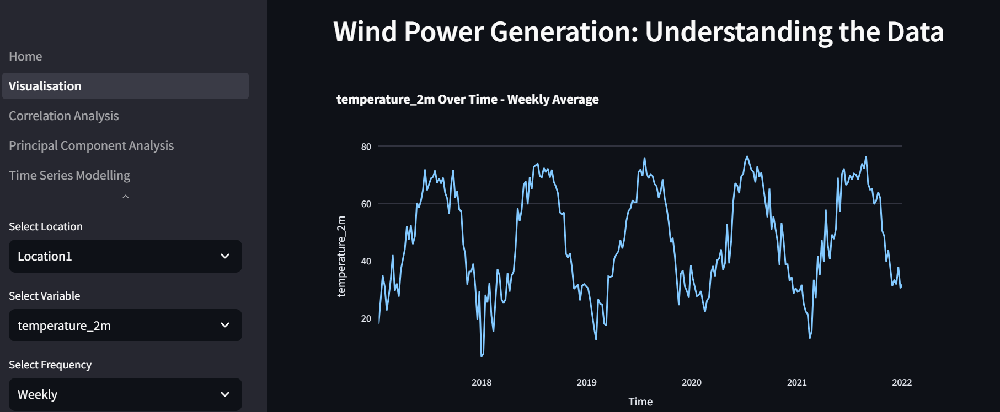
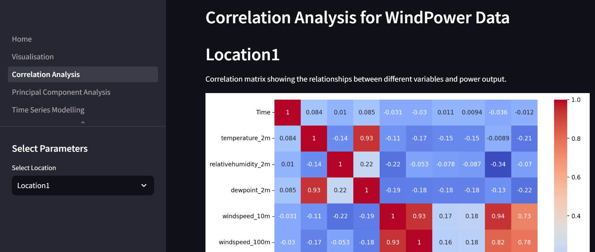
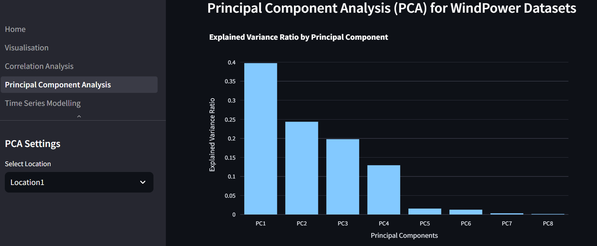
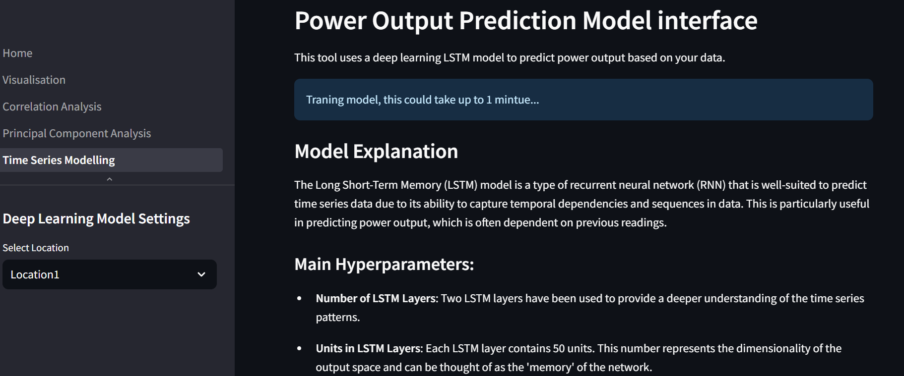

# Wind Power Generation Analysis App

## Overview
The Wind Power Generation Analysis App is a comprehensive tool for exploring and analyzing wind power generation data across four locations. It offers insights into how meteorological factors affect wind power production. The app consists of several pages, each with a specific function.

### Home Page

- **Title**: Wind Power Generation Analysis App
- **Features**:
  - Introduction and overview of the app.
  - Dataset information: Details on temperature, humidity, dew point, wind speeds, wind direction, gusts, and power generation.
  - Source of the dataset: Link to [Kaggle](https://www.kaggle.com/datasets/mubashirrahim/wind-power-generation-data-forecasting).
  - Instructions on how to use the app.

### Visualization Page

- **Functionality**: 
  - Load and visualize wind power data.
  - Plot data based on user-selected variables and frequencies (Hourly, Weekly, Monthly, etc.).
  - Display variable descriptions and their respective plots.
- **User Inputs**: 
  - Location selection.
  - Variable selection.
  - Frequency of data visualization.

### Correlation Analysis Page

- **Purpose**: 
  - To analyze the correlation between different variables and power output.
- **Features**:
  - Correlation matrix heatmap.
  - Interpretation of results explaining positive, negative, and neutral correlations.

### Principal Component Analysis (PCA) Page

- **Functionality**: 
  - Conduct PCA on the dataset.
  - Display explained variance ratio by principal components.
  - Show correlation matrix with power output.
  - Identify the most influential variables for each principal component.
- **Analysis**:
  - Detailed insights into the relationship between principal components and power generation.
  - Interpretation of results, including correlation matrix insights and influential variables.

### Time Series Modelling

- **Purpose**: 
  - Predict power output using a Long Short-Term Memory (LSTM) model.
- **Features**:
  - Explanation of the LSTM model and its hyperparameters.
  - Model training interface with progress visualization.
  - Evaluation of model performance with plots and test loss analysis.
  - Actual vs predicted power output comparison.
- **User Interaction**: 
  - Select location.
  - Train the model and visualize predictions.

### General Features
- The interactive app allows users to select locations and variables for analysis.
- Graphical representations (line plots, heatmaps) enhance data comprehension.
- Detailed explanations accompany each analysis for user guidance.

### Conclusion
This Streamlit app is a powerful tool for wind power data analysis, offering various data processing and visualization capabilities. It's designed for both beginners and advanced users interested in wind energy dynamics.

### Contact Details
##Interested in similar applications?

Email: [luistoq@outlook.com](mailto:luistoq@outlook.com)  
[LinkedIn Profile](https://www.linkedin.com/in/luis-toral-251007/)
